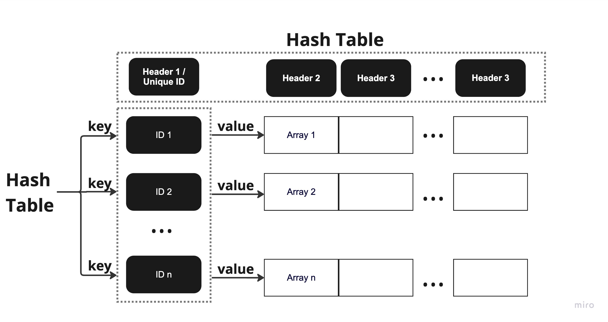

# Building Database From Scratch

A database that is built by hash table, which allows O(1) search time for any value.

## Description

If building a database by arrays, the search time for any value would be O(n^2). Thus this project is to create a database that achieves the O(1) search time by using hash table and its techniques. More particularly, the database will have the following structure:



The first row is the header row, which is built by a hash table. Each header will be a key and transform into a hash value using a hash function called "Cyclic shift Hash Function". Based on the hash value, the header will be stored in the corresponding index of the hash table. To keep track of the original index of each header, I will link the index to the key using seperate chaining.

The first column is the unique ID column, which is also built by another hash table. Each unique ID wil be a key and transform into a hash value using a hash function called "Cyclic shift Hash Function". Based on the hash value, the ID will be stored in the corresponding index of the hash table. I then link the ID with the corresponding row, which is an array, using seperate chaining.

To handle collisions, I use open addressing with linear probing.

By this way, we can search a value with O(1) search time if we know which column it is in and which ID it is. 

## Getting Started

* Run the main.cpp to run the program
  
* Create a database
Example: 
```
Enter the number of columns and rows of your database: 4 5
Enter the names of the columns in one row. The first column must be the unique ID: StudentID FirstName LastName Grade
Enter the values of each column in one row:
0001 Ngoc Doan 10
0002 Emma Smith 7
0003 Olivia Johnson 8
0004 Liam Williams 3
0005 Ethan Brown 5
```
Note that the maximum amount for the database is 100x100

* Perform your queries
```
printTable
```
  to print the whole database
```
searchValue column id
```
  to search for any value with the known column and id
```
searchColumn column
```
  to search if the column exists
```
searchID id
```
  to search if the ID exists